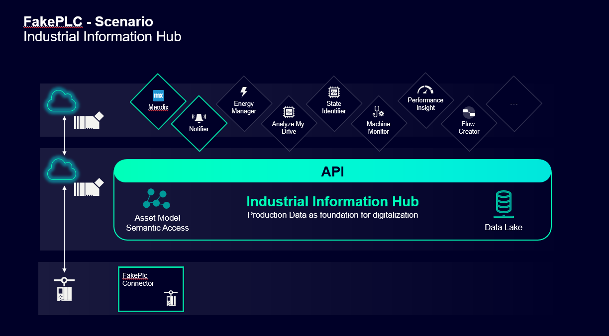
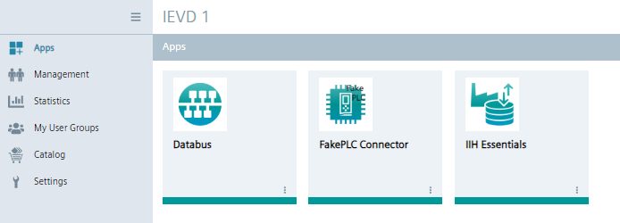
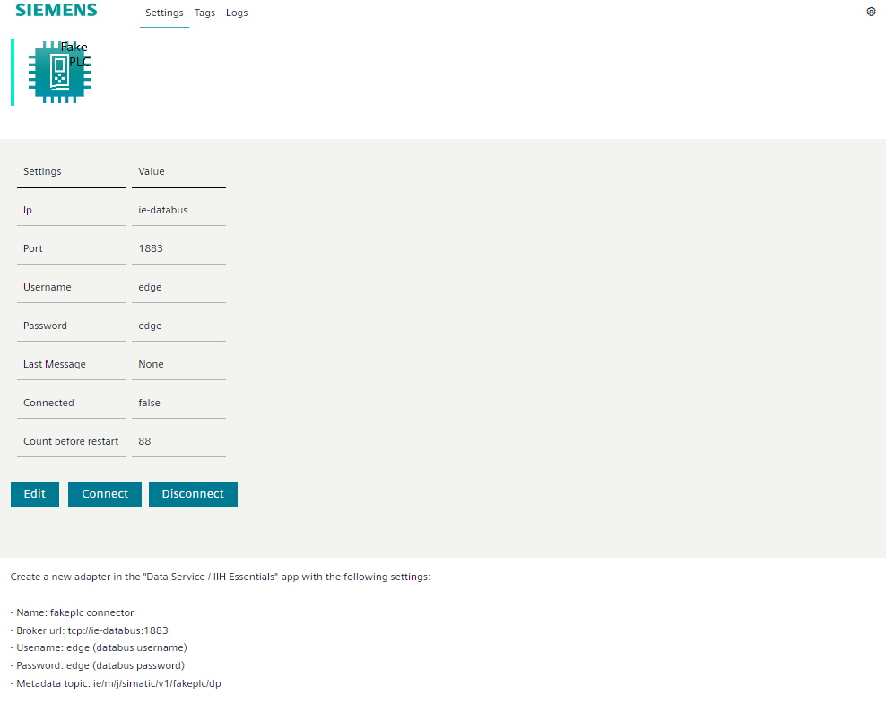
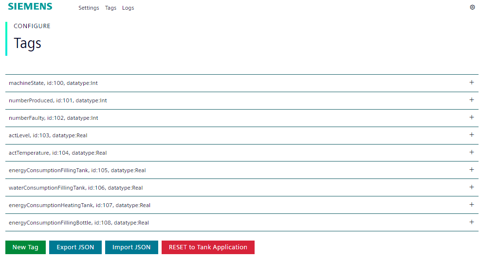
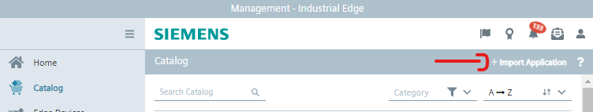
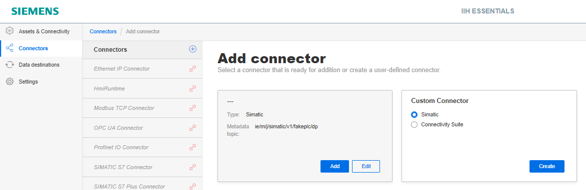
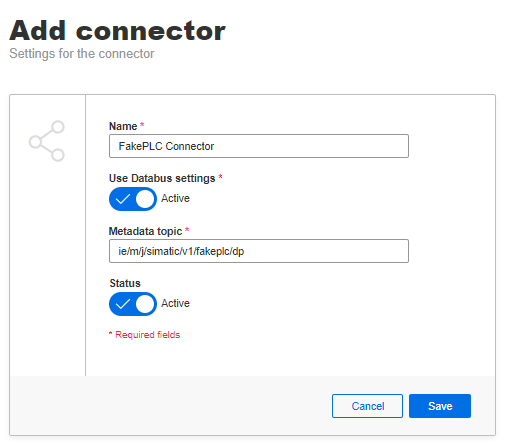
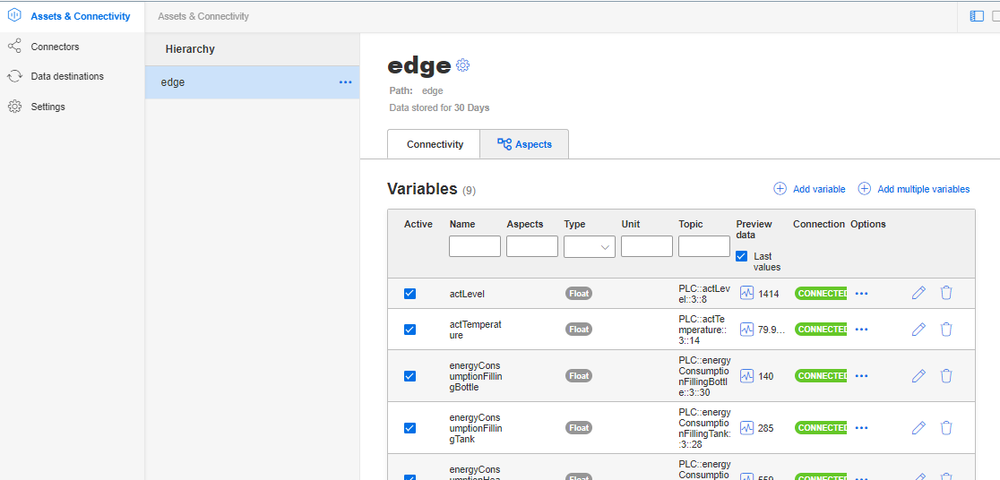

# FakePLC Connector
The fakeplc connector generates data from the [Tank Application](https://github.com/industrial-edge/miscellaneous/tree/main/tank%20application)

###### Tags:
* machineState | Int
* numberProduced | :Int
* numberFaulty | Int
* actLevel | Real
* actTemperature | datatype:Real
* energyConsumptionFillingTank | Real
* waterConsumptionFillingTank | Real
* energyConsumptionHeatingTank | Real 
* energyConsumptionFillingBottle | Real

## Example Scenario's
Possible scenarios to use this app for

* [Archiving and visualisation](https://github.com/industrial-edge/archiving-and-visualization)
  * Fakeplc Connector, databus, influx and grafana
  
* [Iot gateway](https://github.com/industrial-edge/iot-gateway)
  * Fakeplc Connector, Databus, Cloud connector and Flow creator.

* [Data service getting started](https://github.com/industrial-edge/data-service-getting-started)
  * Fakeplc Connector, Databus and IIH Essentials

* [Notifier getting started](https://github.com/industrial-edge/notifier-getting-started)
  * Fakeplc Connector, Databus, Dataservice and Notifier

* [Performance insight getting started](https://github.com/industrial-edge/performance-insight-getting-started)
  * Fakeplc Connector, Databus, Dataservice and Performance insight

* [Performance insight oee dashboard](https://github.com/industrial-edge/Performance-Insight-OEE-Dashboard)
  * Fakeplc Connector, Dataservice, Databus and Performance insight

* [Energy manager getting started](https://github.com/industrial-edge/energy-manager-getting-started)
  * Fakeplc Connector, Dataservice, Databus and Energy manager.
    

    

## App on device
Required apps for a minimum setup is FakePLC Connector, Databus and IIH Essentials.

## Settings Page
For more information at own connectors please refer to [common payload format](https://github.com/industrial-edge/common-databus-payload-format)
Here you can setup connectivity. by default it connects to the ie-databus broker at ie/# and user/password: edge/edge

## Tags Page
Here you can setup your own tags, by default the tank application is used.

# Installation

## Step 1 - Setup Databus
Please setup the databus as shown here [link](https://github.com/industrial-edge/S7-Connector-data-handling-getting-started/blob/main/docs/Installation.md)

## Step 2 - Install FakePLC Connector
Import the [fakeplc_connector.app]() file into your IEM (industrial edge management)

## Step 3 - Install and Use the IIH Essentials App
- Install IIH Essentials
- Open IIH Essentials
- Go to Settings (Navigation) > Databus Settings > Set broker url to : tcp://ie-databus:1883, username to : edge, passwod to : edge and save
- Go to Connectors (Navigation) > A new suggestion should appear > Edit > Give it the name "Fakeplc Connector" > Activate status > Save > Now it should be connected
- Go to Assets (Navigation) > Add Multiple variables > Select all from FakePLC Connector and Save > Preview data > Checkbox Last Values and see the new Data.

###### Notes*
Anywhere metadata/data topics are used, replace: opcuac1 or s7c1 for example with fakeplc. Like: "ie/m/j/simatic/v1/opcuac1/dp" will become "ie/m/j/simatic/v1/fakeplc/dp"

